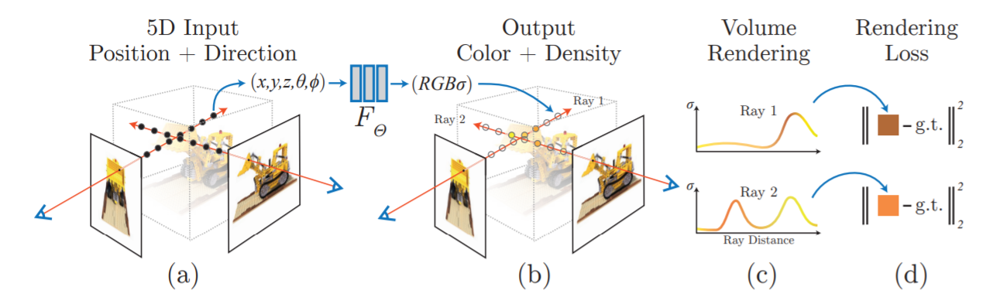

## Implicit Representation ##
The word implicit means "suggested though not directly expressed". Following this nuance, in implicit representations the 3D information is not definitely expressed. Rather in this method the neural network is assumed to learn the 3D information and its weights are the representation of the scene. So this forms the ideal recipe for supervised learning where we learn the 3D information by feeding the network with the scene information represented using the camera parameters. Although it seems to be a perfect way to represent a scene, it has its own merits and de-merits.

Let us understand how this works before exploring its efficiency. We will use NeRF (Neural Radiance Fields) as an example for implicit representation. In this work, they use a deep fully connected network to learn the color $(\in \mathbb{R}^3)$ and density $(\in \mathbb{R})$ information of the scene as a function of the location $\begin{bmatrix} x &y &z \end{bmatrix}^T$ on a ray and its orientation $\begin{bmatrix} \theta &\phi \end{bmatrix}^T$.  **Provide Examples**. To intuitively understand the output color and density information given by the network, consider a camera ray passing through the scene as shown in figure \ref{fig:nerf2}. The final color information that we see on the image formed is all embedded in this ray. The final color contributed by this ray is the accumulation of all the color surfaces this ray passes through before reaching the camera. And on its way to the camera the ray can pass through different types of transparent, opaque and translucent surfaces. The network essentially tries to trace out the path through which the ray has travelled and this path can be expressed using the color and density information. The output color gives the RGB information of every point along the path while the output density is the probability of a surface being present at every point along the path. Hence, by combining the color and density information we can essentially reconstruct the scene.

h&theta;(x) = &theta;o x + &theta;1x

So essentially in the NeRF paper, a single MLP is overfitted for a scene. By overfitting, we mean to say that the MLP is trained by showing it images of the same scene but captured from different views. During inference, this overfitted MLP regresses the Color and Density information when queried with a novel camera location and direction. 

The network used in NeRF is a straightforward MLP with no convolutions involved. For this representation to be multiview consistent the network is restricted to predict the density as a function of only the location x, while allowing the RGB color c to be predicted as a function of both location and viewing direction. %To accomplish this, the MLP first processes the input 3D coordinate x with 8 fully-connected layers (using ReLU activations and 256 channels per layer), and outputs σ and a 256-dimensional feature vector. This feature vector is then concatenated with the camera ray’s viewing direction and passed to one additional fully-connected layer (using a ReLU activation and 128 channels) that output the view-dependent RGB color.

Although using this approach we get the complete information of the scene, the downside to this approach is its inference time. For querying one input we would need an forward pass through the deep MLP network. And hence explicit representations were used to address this issue.
